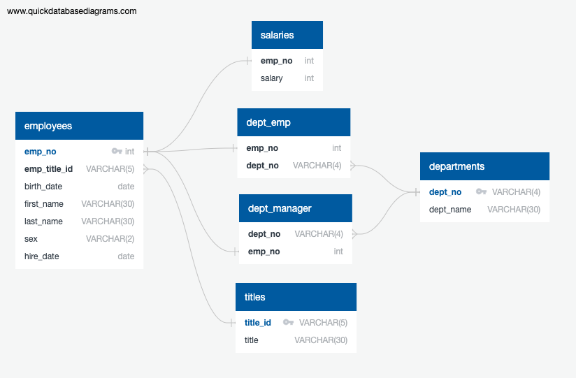

# sql-challenge: Pewlett Hackard Database Exercises
This activity includes database setup and data retrieval exercises with a 'Pewlett Hackard' data set including employee, department, title, and salary data.

An ERD of the database is presented here:

This ERD image was generated using the [Quick Database Diagram Tool](http://www.quickdatabasediagrams.com/)

Main schema (.sql) files include:
- jmp_tables_schema.sql
    - Intial table set up using exported .sql from [Quick Database Diagram Tool](http://www.quickdatabasediagrams.com/)
    - Adjustments and comments by jmp to drop tables if the database tables had already been created and need to be re-made, create a database called "Pewlett_Hackard_db", and set up individual tables with foreign keys.
    - CSV files can be imported using pgAdmin4, import in the same order as tables appear in the schema.
- jmp_queries_schema.sql
    - Individual queries to address various items of interest within the database
    - Each query has comments to describe the expected content of each query, and any notes specific to the query

The 'EmployeeSQL' folder contains CSV files to import into the tables of the database.  Each database table has the same name as the corresponding CSV file.